# Times Series Forecasting 

# 1. Project Description

**Eletrical comsuption forecasting**
- In this project, I will **forecast eletricity comsuption in Brazil**. 
- The forecast will be performed using five **statistical forecasting models** and three **machine learning models**.
- The **trend**, **seasonality**, **cyclicality** and the **irregular component** of the time series are extracted and analyzed using different methods.
- Forecasting models are **trained** with data from the series and **validated** with the most recent data from the historical series.
- Different **error metrics** are used to measure the quality of forecasting methods
- **Cross-validation** is performed to increase confidence in the metrics used.
- The best-ranked methods are used to forecast consumption values ​​for the next year.

Future project features:

**Daylight Saving Time Analysis**
- Add the historical data on the adoption of the **daylight saving time public policy**.
- Analyze the influence this public policy had on electricity consumption in the country.
- Generate a result to **support the decision** on whether or not to reinstate daylight saving time.
- **Calculate the amount of energy savings or additional expenditure** resulting from the adoption of the policy.

**Temperature Analysis**
- Add the **historical average temperature series** for each federative unit in the country.
- Analyze the **influence of temperature on monthly electricity consumption** in the country.
- Calculate the **impact of temperature** on consumption in Brazil
- Generate a model for the increase in average temperature due to **global warming**.
- Create **forecast** models for energy consumption
- Observe the increase in this consumption with the increase in average temperature.
- Calculate the relative **increase in consumption due to global warming** and the energy expenditure associated with this increase.
- Create a forecast model for possible **critical points** in electricity consumption in Brazil.

To finally generate a general analysis determining the **dynamics of electricity consumption in Brazil**, what the **impact of global warming** is and whether or not the increase in the planet's average temperature favors the resumption of the policy of **adopting daylight saving time**.

# 2. Solution Pipeline
The **solution pipeline** is based on the **crisp-dm** framework:
1. Business understanding.
2. Data understanding.
3. Data preparation.
4. Modelling.
5. Validation.
6. Deployment.

# 3. Pipeline

1. **Problem understanding :**

- The problem to be solved with this project is to predict electricity consumption in Brazil based on historical data.
- In the future, an analysis of the influence of daylight saving time and temperature on the consumption time series will be added to ultimately support decisions about whether or not to adopt a public daylight saving time policy.

2. **Data Understanding:**
- The Energy Research Company of the Brazilian government's Ministry of Mines and Energy provides historical data, from 2004 onward, on monthly electricity consumption and the number of consumers at the national, regional, and subsystem levels, segmented by consumer type (captive or free) and by class (residential, industrial, commercial, and others).
- Historical electricity consumption series are available in .xlsx format, as exemplified in Figure X below.

 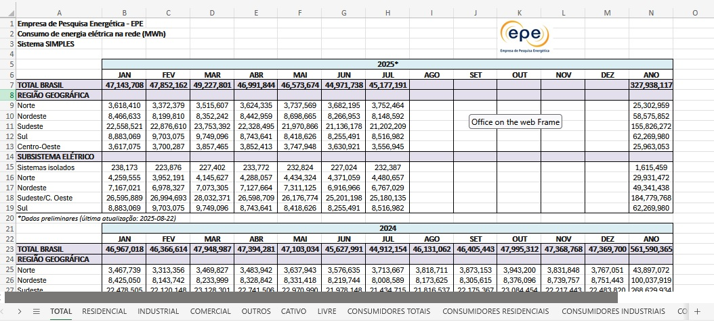

- The .xlsx file consists of separate tabs for consumption and the number of captive and free consumers, by region and class, or by federal unit.
- The data provided is available monthly.
- Consumption data does not contain NaN values.
- NaN values ​​for the number of consumers are fill as 0.
- Consumption data is available in units of MWh.
- Data separated by federative unit allows us to analyze the impact of adopting daylight saving time, since this public policy was implemented by federative unit.

- Historical data on the adoption dates of daylight saving time and the states in which it was adopted are available online.
- The National Institute of Meteorology provides monthly historical temperature data measured at each of the meteorological stations throughout the country, allowing for the calculation of an average temperature per federal unit and the historical series of these temperature data.
- From the data made available by INMET, data from operating conventional meteorological stations were used, and in the period covered by the time series of electricity consumption, from January 2004 to the present.
- The data are made available in a zipped file in which there is a .csv file for the historical series of each station, with the identification of each station, the geographic location, the start and end date of the historical series and the values ​​of the average monthly temperature measured.
-The file in figure XX shows an example of the .csv files made available by each weather station.
- After obtaining the temperature for each station, a weighted average is calculated by region covered by each station to finally generate an average temperature value for each federative unit of the country.
- These files contain NaN values ​​for temperatures; periods without available data will be evaluated to determine the best method for dealing with missing values.

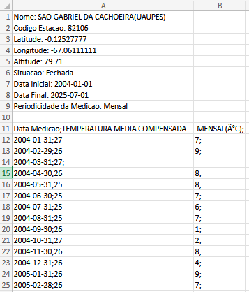

**Some particular features of the base - Electricity Consumption**
- Consumption related to captive consumers is predominantly residential (~70%).
- Consumption related to free consumers is predominantly industrial (~75%).
- The captive consumption time series does not have a clear trend component but does have a seasonal component.
- The free consumption series has a clear positive trend component and a weak seasonal component.
- The total consumption series (captive + free) therefore has a positive trend component and a seasonal component.
- Captive consumption still accounts for the majority of electricity consumption in the country, but free consumption is likely to dominate in the coming years.

**Some particular features of the base - Temperature**

**Some particular features of the base - Daylight saving time**

3. **Data Preparation:**

**Data Import and Preprocessing**
Relevant information is extracted from the databases and dataframes are filled with the information that will be used in the analyses.

- Import historical consumption data.
- Import daylight saving time serie. 
- Import temperature data
- Handling missing values.
- Data preprocessing.
- Fitting data to pandas Dataframe formats - wide, compact and expanded.

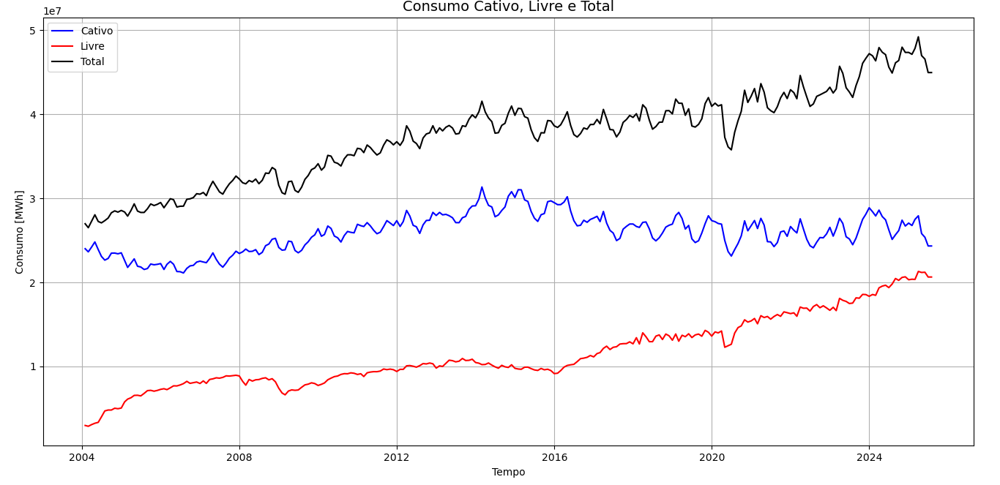

4. **Modeling:**

1. **Detrending**
Visual analysis of the charts reveals a clear trend component. We'll use different methods to extract this component and measure these methods to determine the best detrending result.

- The total consumption time series is used in this analysis.
- Detrending is performed using the moving average and LOWESS (locally weight estimated scatterplot smoothing) methods.
- The extracted trend components are shown in Figures XX and XX1.
- The calculated metrics are shown in YY.

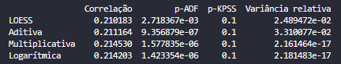

- The metrics indicate that the moving average decomposition method with a multiplicative model is the best model; the LOWESS model also has good parameters.
- Analysis of the time series detrended by the different methods shows that the multiplicative model flattens the curve too much, which is undesirable.

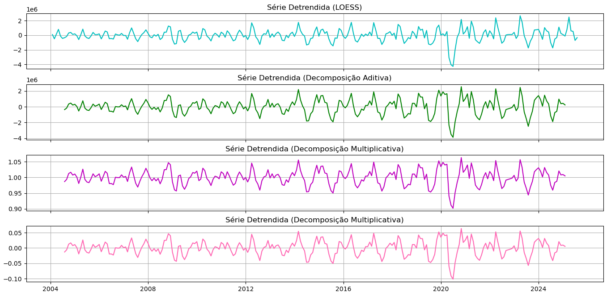

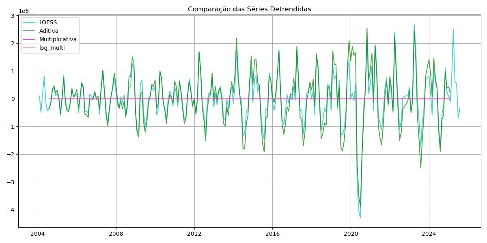

- I perform a logarithmic transform on the raw time series and a decomposition with an additive model, which is similar to applying the multiplicative model but can reveal whether the behavior flattens the curve too much.
- The logarithmic model combined with the additive decomposition confirms the undesirable behavior of the multiplicative model.
- Decomposition using the LOESS method is chosen as the most appropriate.

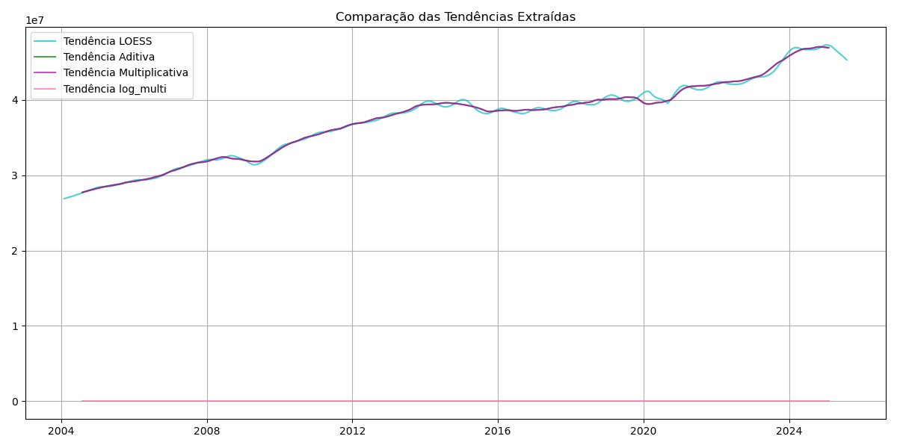

2. **Deseasonality**
Visual analysis of the consumption time series after detrending indicates the presence of trend and cyclical components.

- The consumption time series without the trend component is used in this analysis (detrending-loess).
- Graphs of the autocorrelation and partial autocorrelation of the detrended series data are plotted.

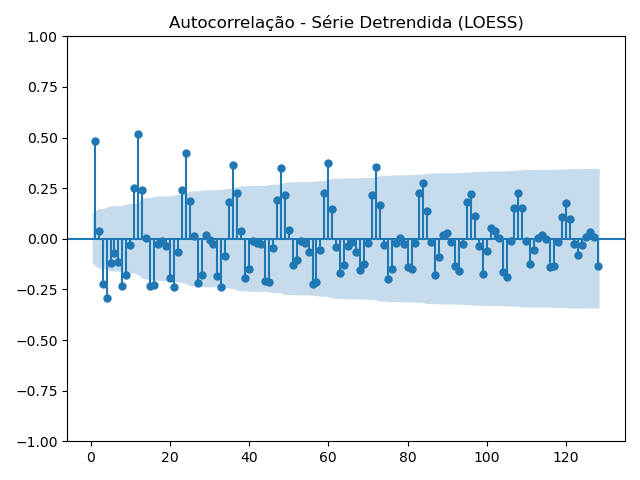

- The total and partial autocorrelation graphs indicate the presence of seasonality in 12-month (1-year) periods.
- The partial autocorrelation graph shows an average correlation with 60-month (5-year) periods, which could indicate the presence of a cyclical component.

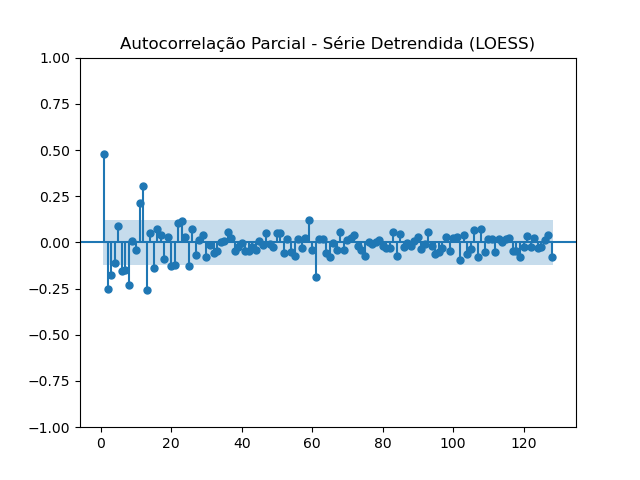

- Fourier series decomposition is performed on the detrended time series.
- I define the error metrics to be used to quantify the quality of deseasonality.
- I plot the error metrics by the number of harmonics used in the Fourier series.

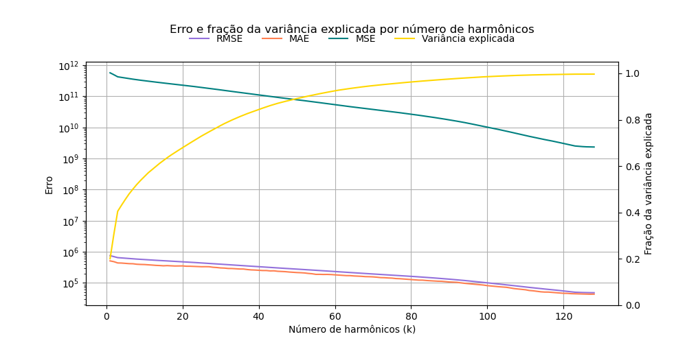

- This plot indicates an optimal value of 53 harmonics in the Fourier series, explaining a total of 90% of the variance observed in the detrended series. - The seasonality and cyclicality components are reconstructed with the first 53 harmonics.
- The frequency magnitude spectrum shows the low frequency of 60-period components to justify a possible 60-month cyclicality.

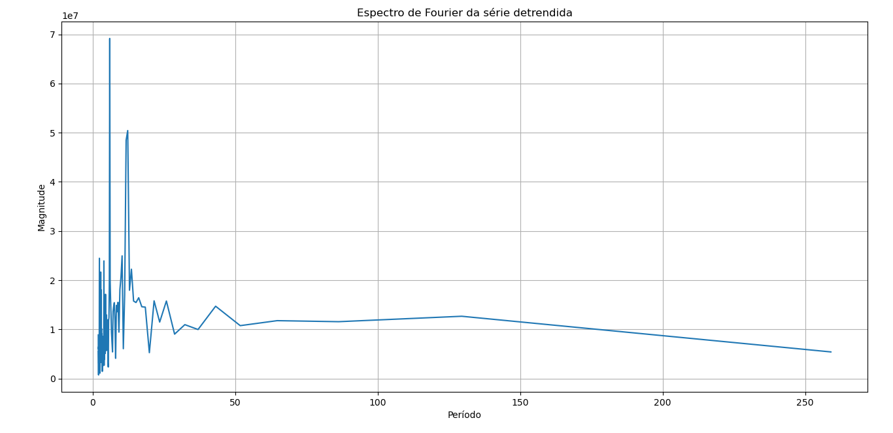

- The seasonality component is removed from the detrended series, leaving what we will call the irregular component of the time series.

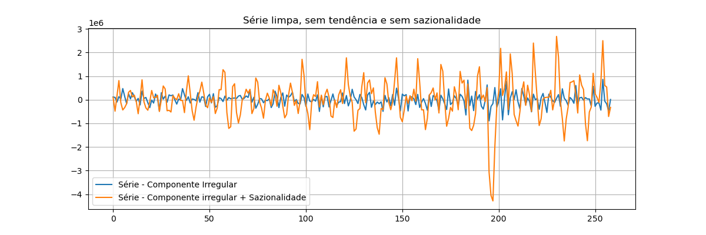 
    
3. **Forecast**

- In this part of the project, we will forecast the time series.
- The forecast horizon is determined in 12 months.
- The maximum number of epochs for Neural forecast methods is determined in 200.
- All the Neural forecast methods use the MAE as loss function.
- The forecasts for each method are plotted below:

Naive: Uses the last observed value as the forecast for the next point.

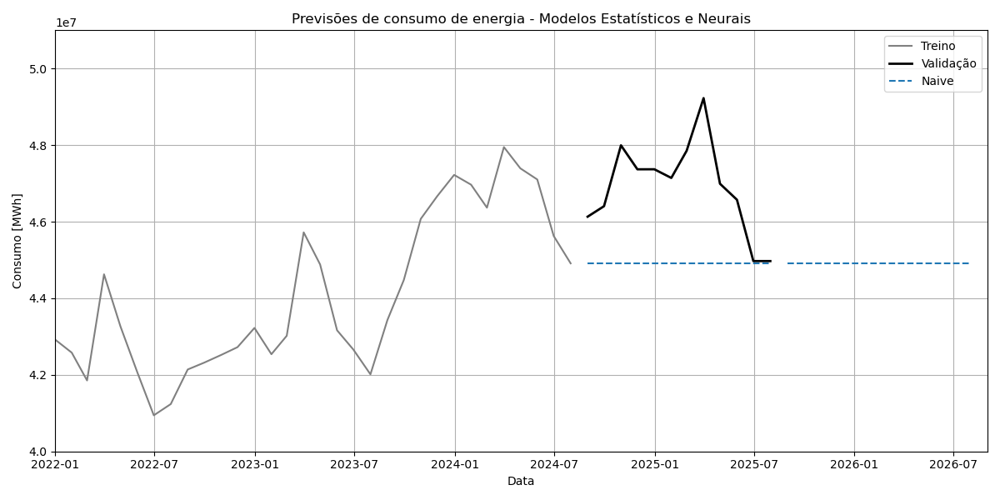 

SeasonalNaive: Forecast equal to the observed value at the same position as the last station.

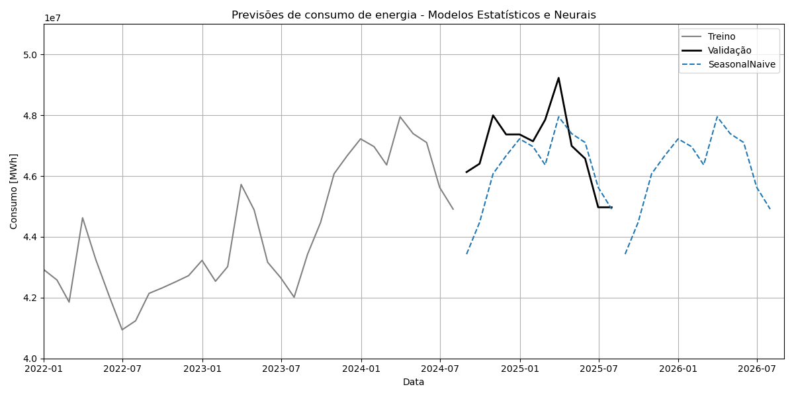 

ETS: Exponential smoothing models that automatically adjust for level, trend, and seasonality.

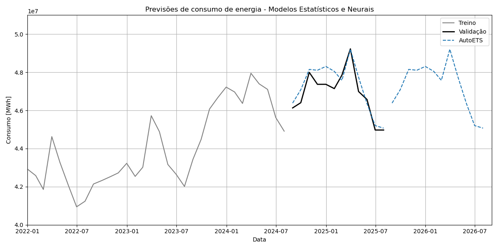 

ARIMA: Integrated autoregressive moving average model that adjusts for temporal dependence, trend, and seasonal patterns.

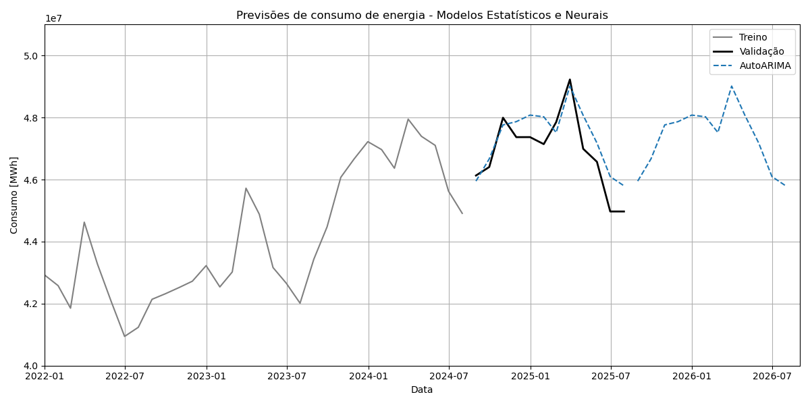 

Theta: Combines projections of smoothed series with different "angles" to capture trend and level.

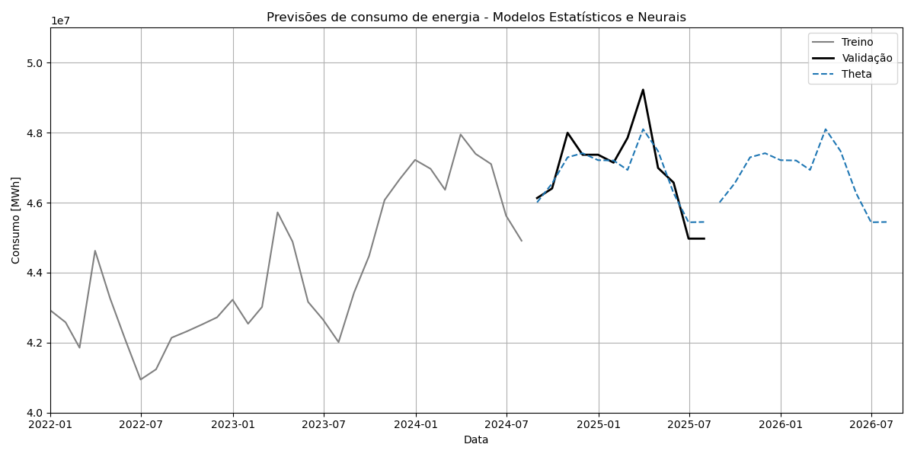 

NBEATS: Deep neural network that learns trend and seasonality patterns directly from the data.

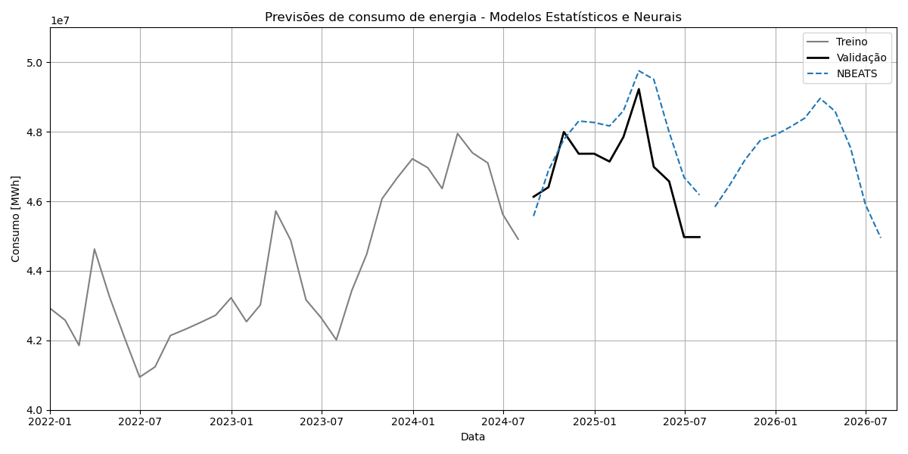

NHITS: Evolution of N-BEATS with a hierarchical architecture, learning short- and long-term dependencies.

 

PatchTST: Transformer-based model that divides the series into "patches" and learns complex temporal patterns.

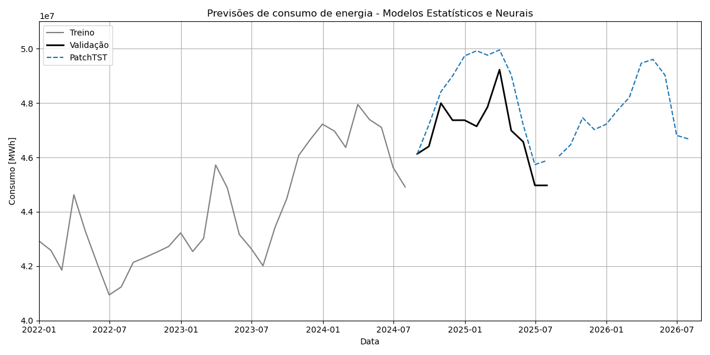

4. **Evalution:**
- The metrics used to evaluate the prediction errors were:

**MAE** (Mean Absolute Error): Measures the average absolute error between predicted and observed values, indicating the average deviation without considering the direction.

**MSE** (Mean Squared Error): Calculates the mean of squared errors, penalizing larger discrepancies more heavily.

**MAPE** (Mean Absolute Percentage Error): Expresses the average absolute error as a percentage of the actual values, allowing for relative interpretation.

**sMAPE** (Symmetric Mean Absolute Percentage Error): A symmetric version of MAPE, balancing the relative error between predicted and observed values.

**MASE** (Mean Absolute Scaled Error): Compares the model's error to a simple baseline model, enabling relative evaluation across series of different scales.

- The metrics are first calculated for each method when predicting the validation data.
- Subsequently, cross-validation is performed with the database to generate the forecast at different points in the time series.
- Cross-validation generates the forecasts for each method in six windows of the time series.
- Evaluation metrics are calculated in each of the cross-validation windows, and finally, the simple average of the metrics for each is generated.
- The average values ​​of the metrics calculated in the cross-validation are used to define the four methods that best suit the data forecast.
- The average values ​​of the metrics are shown in Figure XX.

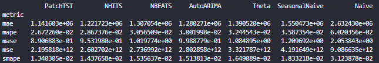

- The four methods that perform best in the metrics are used to generate the final forecasts, which are shown in the figure below.

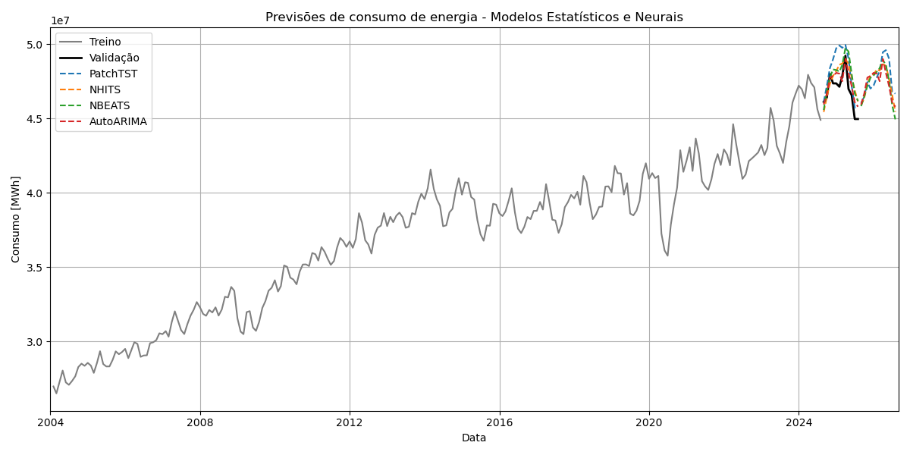

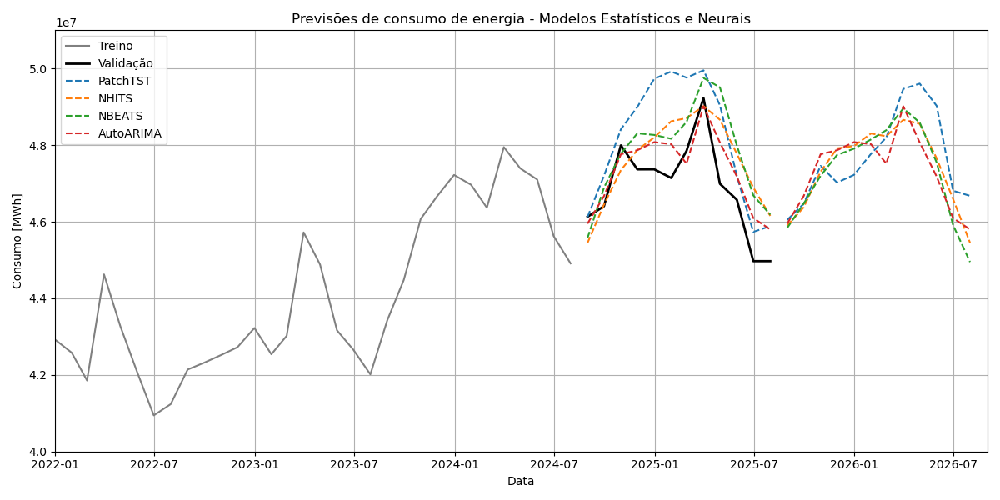

# 4. Data origin

- The data used are provided by the energy research company, linked to the Brazilian government's Ministry of Mines and Energy. The data are released monthly and separated by consumer type, state, and class. The data are available electronically and can be obtained at (https://www.epe.gov.br/pt/publicacoes-dados-abertos/publicacoes/consumo-de-energia-eletrica).
- Average temperature data per meteorological station are provided by the National Institute of Meteorology (INMET) and are available at the link (https://portal.inmet.gov.br/).
- Historical data on the adoption dates of daylight saving time and the states in which it was adopted are available online. The data used here are available at (https://pt.wikipedia.org/wiki/Lista_de_per%C3%ADodos_em_que_vigorou_o_hor%C3%A1rio_de_ver%C3%A3o_no_Brasil).

# 5. Technologies and Toools Used
- Python (Pandas, Numpy, Matplotlib, Seaborn, Sciki-Learn, Statsmodels, Virtual Envs).
- Statistics.
- Data cleaning, manipulation, visualization and exploration.
- Detrending methods: LOWESS and moving averages
- Deseasonality methods: Decomposition on Fourier series.
- Statistical forecast algorithms: Naive, SeasonalNaive, ETS, Theta and ARIMA.
- Machine learning algorithms: NBEATS, NHITS, PatchTST.
- Error metrics: MAE, MSE, MASE, MAPE, sMAPE.
- Cross-validation

# 6. Contact me
- Linkedin: https://www.linkedin.com/in/valentelucas
- Github: https://github.com/valente-lucas
- Gmail: l.carvalente@gmail.com